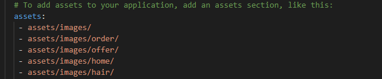
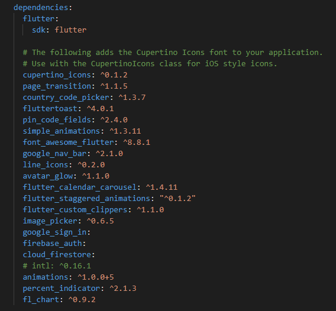

# Stylacs Beautician App.

# Description:
  Our solution will provide platform to those women who've a beautician within her and  to transgenders who're looked down upon. The       availing of the platform by transgenders will abolish the stereotypical image of transgenders in Pakistan. The women of our land are     mostly uneducated and lacks any technical skill, henceforth are not illegible to work in a corporate environment and are also unaware   of business know how. On stylacs, they'll be able to monetize their beautician skill because every women has a beautician within her,   all it just needs is a platform.
 
# Getting Started:
   1. Windows or Mac OS
   2. Flutter SDK
   3. Android Studio
   4. Any IDE
   5. To run and display the app you need an android emulatore or IOS semulatore or a physical device.
   
# Installing & Executing:
  Github has a direct upload files limit of 100 and we are facing some issues while pushing the files to github through CMD thats why     the installation & execution is a bit confusing but we are working on it and later on we will fix this.     

  1. Click on clone and then click on download zip to download the Zip folder that contain 2 folders (lib , assets) and a file               (pubspec.yaml).
   2. Now create a new androidx supported flutter project in CMD by using this command (flutter create --androidx project_name). 
   3. Unzip the downloaded folder and copy Lib and assets folder to the newly created flutter project.
   4. Then open pubspec.yaml of downloaded folder and copy all the dependencies and assets and past it to pubspec.yaml of newly created       project.

      
   
   5. Then open the newly project in any IDE and open the pubspec.yaml and save it by pressing (ctrl + s) so that flutter can get all         the mentioned assets and packages.
   6. Connect any physical device to your computer or open your android emulator or IOS simulator. Then open the IDE terminal and type (       flutter run ) to run the project.
   
# Version:
   Version is 2.0
   This is the first version of our app.
  
